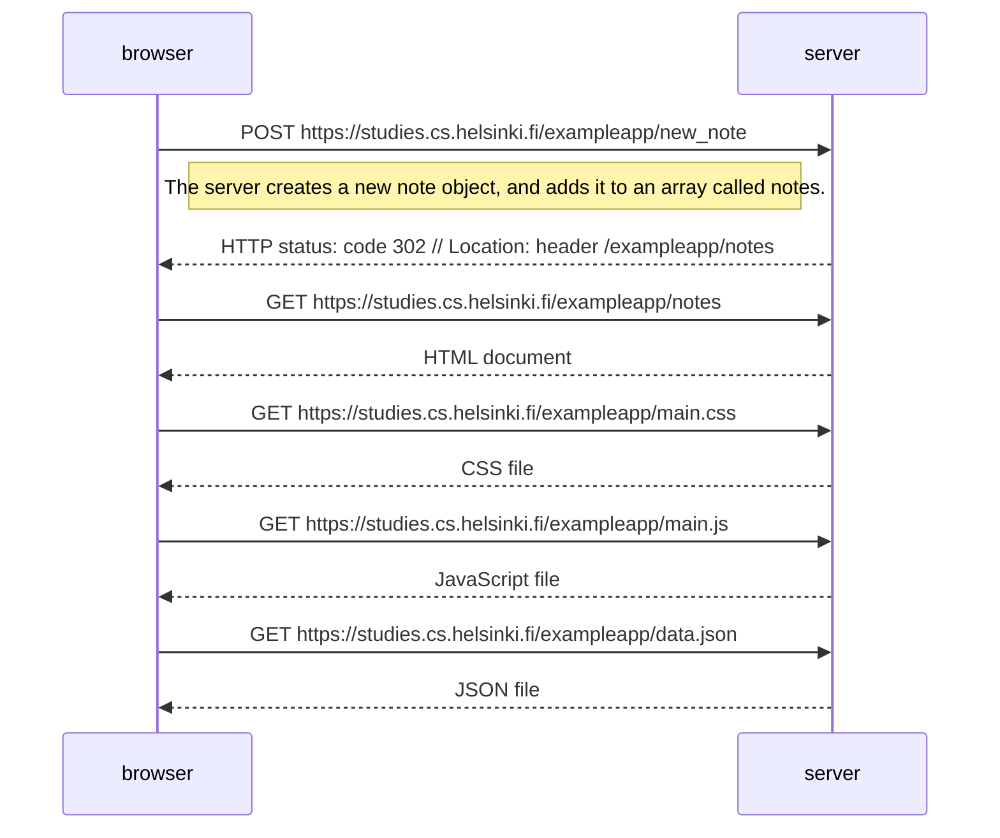

```mermaid
sequenceDiagram
  browser ->> server: POST https://studies.cs.helsinki.fi/exampleapp/new_note
  Note right of browser: The server creates a new note object, and adds it to an array called notes.
  server -->> browser: HTTP status: code 302 // Location: header /exampleapp/notes
  browser ->> server: GET https://studies.cs.helsinki.fi/exampleapp/notes
  server -->> browser: HTML document
  browser ->> server: GET https://studies.cs.helsinki.fi/exampleapp/main.css
  server -->> browser: CSS file
  browser ->> server: GET https://studies.cs.helsinki.fi/exampleapp/main.js
  server -->> browser: JavaScript file
  browser ->> server: GET https://studies.cs.helsinki.fi/exampleapp/data.json
  server -->> browser: JSON file

```
